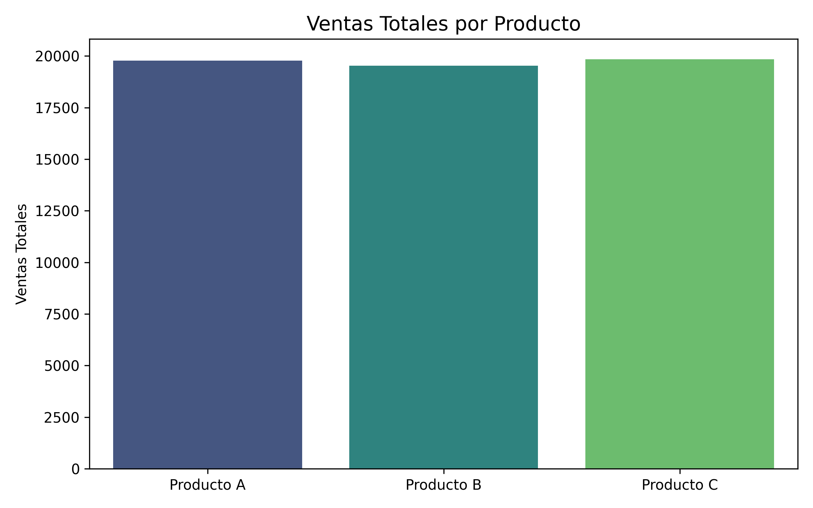
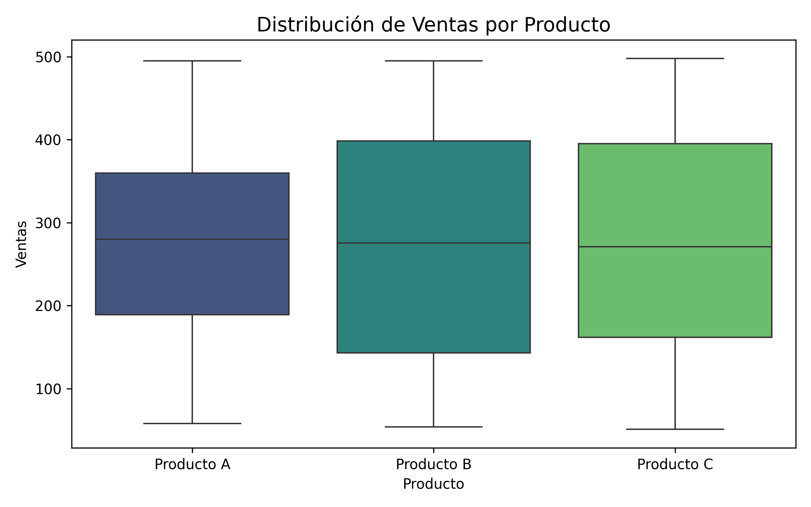

# Caso Práctico - Provident

Se realizó un análisis exploratorio de los datos de ventas, el cual reveló que los productos y las regiones presentan comportamientos diferenciados. Estos hallazgos sugieren patrones de demanda y tendencias particulares que pueden influir en la planificación comercial y la toma de decisiones estratégicas.

## Regiones
La región Norte muestra el mayor volumen de ventas históricas.

<table>
<tr>
<td></td>
<td></td>
</tr>
</table>

## Productos
El producto A presenta un comportamiento más estable al revisar su distribución.

<table>
<tr>
<td></td>
<td></td>
</tr>
</table>

Durante el análisis exploratorio se identificaron diferencias significativas en el comportamiento de ventas según el producto y la región. Esto indica que las dinámicas de consumo no son homogéneas y que cada combinación producto-región podría requerir estrategias específicas de pronóstico y gestión.

El análisis de las series históricas muestra que productos y regiones presentan variaciones y tendencias distintas. Esto sugiere la necesidad de abordar cada segmento con modelos de pronóstico diferenciados, considerando factores locales en la planificación de ventas.

Tras evaluar diferentes alternativas de modelado, se consideró que el modelo de **Holt-Winters** era el más adecuado para nuestro caso. Este modelo permite capturar tanto la tendencia como la estacionalidad de las series, ofreciendo pronósticos más consistentes y suavizados. Aunque se exploraron otros enfoques, las características de las series—como la variabilidad por producto y región y la presencia de patrones estacionales—hicieron que Holt-Winters proporcionara resultados más interpretables y confiables para la planificación de ventas.

Se observa que el pronóstico sigue la tendencia típica de disminución en enero y febrero, como ocurre cada año.
El análisis exploratorio y de pronóstico realizado permitió identificar patrones diferenciados de ventas según productos y regiones, evidenciando que las dinámicas de consumo no son homogéneas. La serie histórica mostró tendencias y estacionalidades claras, como las disminuciones recurrentes en enero y febrero, así como variaciones en el comportamiento de cada producto y región. Tras evaluar distintos modelos de pronóstico, se determinó que el modelo de Holt-Winters era el más adecuado, al capturar tanto la tendencia como la estacionalidad, ofreciendo predicciones consistentes y confiables.

Como propuesta para trabajos futuros, se sugiere explorar modelos más complejos o avanzados, como SARIMAX, Prophet o modelos basados en aprendizaje automático, especialmente para combinaciones producto-región con mayor volatilidad. Además, sería valioso ampliar el horizonte temporal de los datos y considerar variables externas que puedan influir en la demanda, como promociones, estacionalidad de mercado o indicadores macroeconómicos. Estas acciones permitirían mejorar la precisión de los pronósticos y apoyar decisiones estratégicas más informadas.
---

**Notebook de trabajo**  
Todo el análisis, los gráficos y los comentarios se encuentran en el notebook: [`CuadernoTrabajoCasoPractico.ipynb`](CuadernoTrabajoCasoPractico.ipynb)