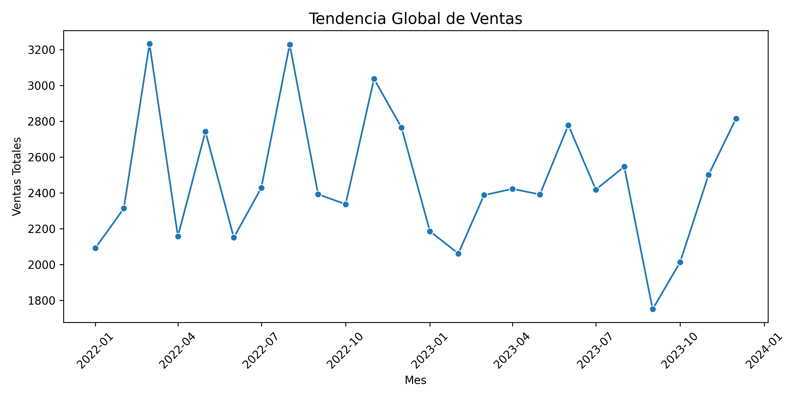
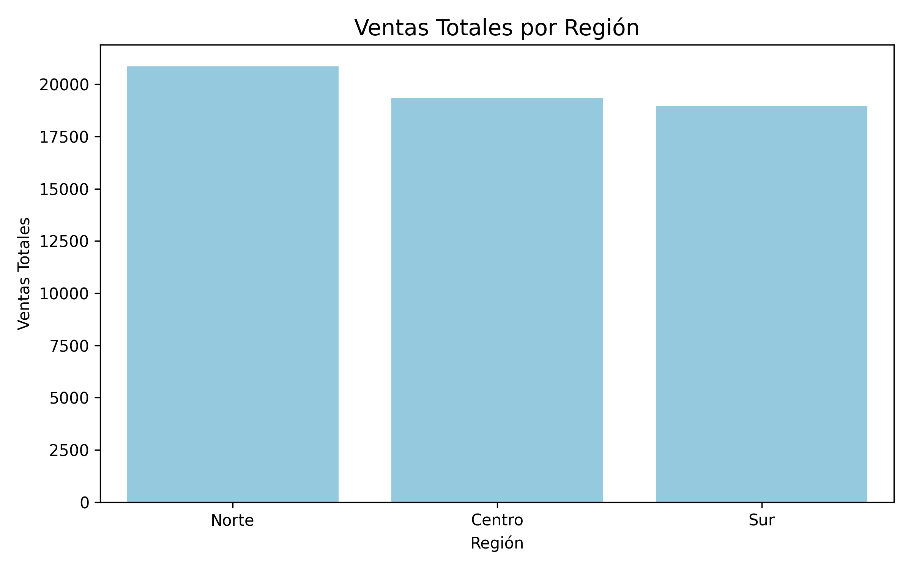
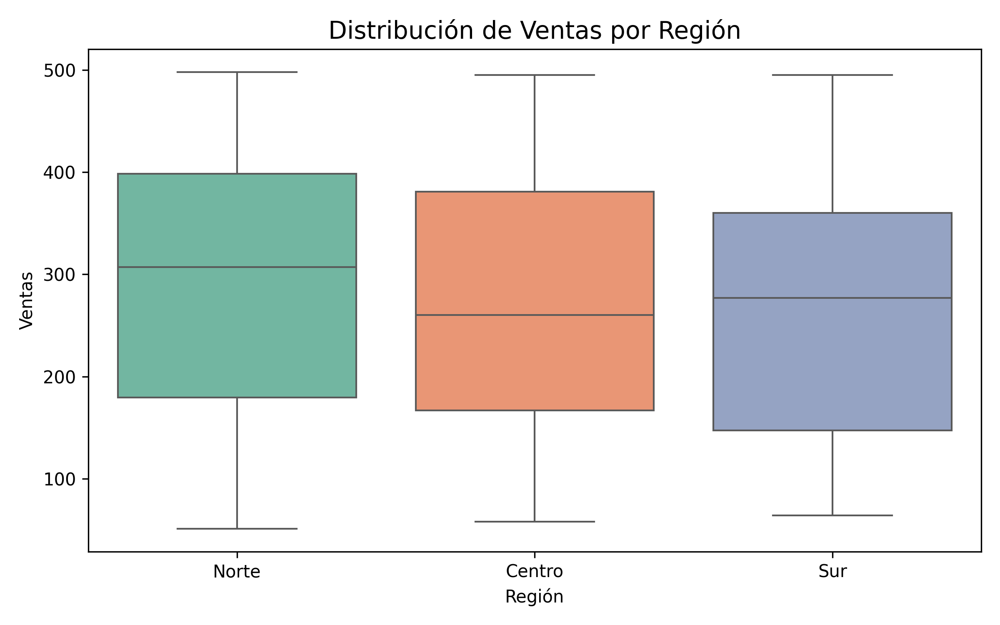
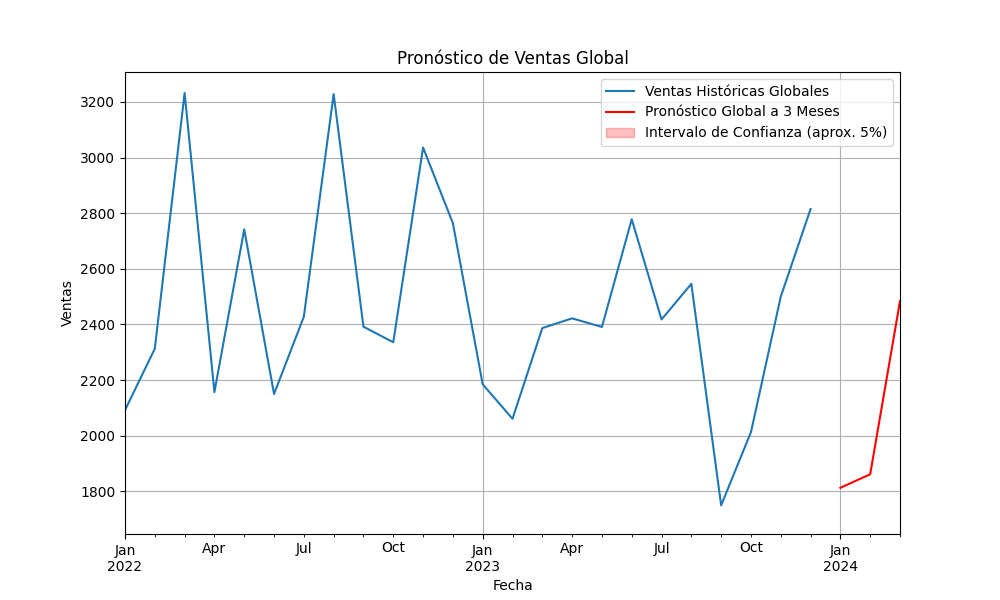

# caso-practico-Provident

Se llevó a cabo un análisis exploratorio de los datos de ventas, a partir del cual se observó que los diferentes productos y regiones presentan comportamientos distintos, sugiriendo patrones de demanda y tendencias particulares que podrían influir en la planificación comercial y la toma de decisiones estratégicas.

Regiones: La región Norte es la que tiene un mayor volumen de ventas historicas

Productos: El producto A es el que más se comporta estable al revisar su distribucción

Durante el análisis exploratorio de los datos, se identificaron diferencias significativas en el comportamiento de ventas según el producto y la región. Estos hallazgos indican que las dinámicas de consumo no son homogéneas y que cada combinación producto-región podría requerir estrategias específicas de pronóstico y gestión.

El álisis exploratorio permitió examinar las series de ventas históricas, revelando que los productos y regiones muestran variaciones y tendencias distintas. Esto sugiere la necesidad de abordar cada segmento con modelos de pronóstico diferenciados y considerar factores locales en la planificación de ventas.

Tras evaluar diferentes alternativas de modelado para las series de ventas, se consideró que el modelo de Holt-Winters era el más adecuado para nuestro caso. Esto se debe a que permite capturar tanto la tendencia como la estacionalidad presente en los datos, ofreciendo pronósticos más consistentes y suavizados. Aunque se exploraron otros enfoques, las características de las series—como la variabilidad por producto y región, y la presencia de patrones estacionales—hicieron que Holt-Winters proporcionara resultados más interpretables y confiables para la planificación de ventas.

Se observa que el pronostico sigue la tendencia de caidas en Enero y Febrero como cada año. 

Toda el analisis y comentarios se encuentra el notebook CuadernoTrabajoCasoPractico.ipynb

